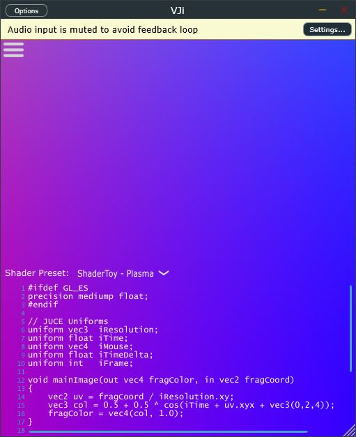

# VJi

A Music Visualizer Plugin (VST3) for DAWs

using GLSL Shaders

made with JUCE Framework



---

## Terminal Commands

### Usage of Repository

```shell
# ----------------------------------------------------------------------------
# usage of this repository
# ----------------------------------------------------------------------------
git clone --recursive https://github.com/floppyinfant/JUCE_VJi.git
cd JUCE_VJi

# if you cloned the repository without "--recursive" or "--recurse-submodules"
# or downloaded the zip-file:
# git submodule update --init --recursive

# ----------------------------------------------------------------------------
# Install WebView2 (on Windows only, using PowerShell)
# ----------------------------------------------------------------------------
Register-PackageSource -provider NuGet -name nugetRepository -location https://www.nuget.org/api/v2
Install-Package Microsoft.Web.WebView2 -Scope CurrentUser -RequiredVersion 1.0.1901.177 -Source nugetRepository

# ----------------------------------------------------------------------------
# Configure, Build, execute
# ----------------------------------------------------------------------------
cmake -S . -B build
cmake --build build
.\build\VJi_artefacts\Debug\Standalone\VJi.exe
```

#### Build for Android

To build the Android APK:

Open the Projucer project file (VJi.juce) and export to Android Studio.

You can compile the Projucer from source `libs/juce/extras/Projucer/` using its `CMakeLists.txt` file or download the latest Projucer from https://juce.com/download/

Then you will need to install Android Studio (plus Android SDK and Tools) from https://developer.android.com/studio. The Android Studio Setup Wizard will download some SDK Platform Package and Tools, otherwise use `Menu Tools > SDK Manager`.

**Maybe I forgot to update the Jucer-file between commits: please add the files or libs manually and send me a message!**

---

---

### Development of Repository

log to remember what I did

```shell
# ----------------------------------------------------------------------------
# initialize git repository
# ----------------------------------------------------------------------------
# create local repo 
git init .
git submodule add https://github.com/juce-framework/JUCE.git libs/juce
git submodule --init --recursive

# stage and commit
git add .
git commit -m "initial commit"

# create remote repo
git remote add origin https://github.com/floppyinfant/JUCE_VJi.git
git push -u origin master
```

#### Add Libraries as gitmodules (submodules)

`libs/` must not be in the .gitignore file.

```shell
git submodule add https://github.com/assimp/assimp.git libs/assimp
git rm --cached -r libs/assimp
git commit -m "Remove assimp from version control"

# GUI
git submodule add https://github.com/VitalAudio/visage.git libs/visage
git submodule add https://github.com/Krasjet/imgui_juce.git libs/imgui_juce

# DSP
#git submodule add https://github.com/electro-smith/DaisySP.git libs/DaisySP
```

##### Link against submodule libraries

###### Visage

```cmake
add_subdirectory(libs/visage)
target_link_libraries(VJi PRIVATE visage)
```

###### ImGui

imgui_juce (imgui_impl_juce is the backend as a juce module):

```cmake
add_subdirectory(libs/imgui_juce)
target_link_libraries(VJi PRIVATE imgui_impl_juce)
```

Dear ImGui Library (has no CMakeLists.txt):

```cmake
# write a CMakeLists.txt file for imgui (can not add file to git because imgui is a submodule):
#add_subdirectory(libs/imgui)
#target_link_libraries(VJi PRIVATE imgui)

# or write a cmake-file and include it (can be added to git):
include(cmake/imgui.cmake)  # instead of add_subdirectory()
target_link_libraries(VJi PRIVATE imgui)
```

cmake-file to compile ImGui:

```cmake
set(IMGUI_DIR ${CMAKE_CURRENT_SOURCE_DIR}/libs/imgui)

# Core ImGui files
set(IMGUI_SOURCES
${IMGUI_DIR}/imgui.cpp
${IMGUI_DIR}/imgui_demo.cpp
${IMGUI_DIR}/imgui_draw.cpp
${IMGUI_DIR}/imgui_tables.cpp
${IMGUI_DIR}/imgui_widgets.cpp
)

set(IMGUI_HEADERS  # variable not used
${IMGUI_DIR}/imgui.h
${IMGUI_DIR}/imgui_internal.h
${IMGUI_DIR}/imconfig.h
${IMGUI_DIR}/imstb_rectpack.h
${IMGUI_DIR}/imstb_textedit.h
${IMGUI_DIR}/imstb_truetype.h
)

# Choose which backend(s) you need based on your rendering system
# For OpenGL3 + your existing windowing system:
set(IMGUI_BACKEND_SOURCES
${IMGUI_DIR}/backends/imgui_impl_opengl3.cpp
# ${IMGUI_DIR}/backends/imgui_impl_vulkan.cpp
# ${IMGUI_DIR}/backends/imgui_impl_wgpu.cpp
# ${IMGUI_DIR}/backends/imgui_impl_sdlgpu3_shaders.h
# ${IMGUI_DIR}/backends/imgui_impl_metal.mm
#
# Add your platform backend:
# ${IMGUI_DIR}/backends/imgui_impl_android.cpp
# ${IMGUI_DIR}/backends/imgui_impl_win32.cpp    # Windows
# ${IMGUI_DIR}/backends/imgui_impl_osx.mm       # macOS
# ${IMGUI_DIR}/backends/imgui_impl_glfw.cpp     # if using GLFW 
# we will be using imgui_juce (imgui_impl_juce) as backend 
)

set(IMGUI_BACKEND_HEADERS  # variable not used
${IMGUI_DIR}/backends/imgui_impl_opengl3.h
${IMGUI_DIR}/backends/imgui_impl_opengl3_loader.h
# ${IMGUI_DIR}/backends/imgui_impl_vulkan.h
# ${IMGUI_DIR}/backends/imgui_impl_wgpu.h
# ${IMGUI_DIR}/backends/imgui_impl_sdlgpu3_shaders.h
# ${IMGUI_DIR}/backends/imgui_impl_metal.h
#
# Add corresponding headers:
# ${IMGUI_DIR}/backends/imgui_impl_android.h
# ${IMGUI_DIR}/backends/imgui_impl_win32.h
# ${IMGUI_DIR}/backends/imgui_impl_osx.h
# ${IMGUI_DIR}/backends/imgui_impl_glfw.h
)

# ----------------------------------------------------------------------------

# Create the library
add_library(imgui STATIC
${IMGUI_SOURCES}
${IMGUI_BACKEND_SOURCES}
)

target_include_directories(imgui PUBLIC
${IMGUI_DIR}                # ${IMGUI_HEADERS}
${IMGUI_DIR}/backends       # ${IMGUI_BACKEND_HEADERS}
)

# Link OpenGL if using OpenGL backend
find_package(OpenGL REQUIRED)
target_link_libraries(imgui PUBLIC OpenGL::GL)

# Platform-specific linking
if(WIN32)
target_link_libraries(imgui PUBLIC imm32)
endif()
```

##### Link against precompiled libraries

```cmake
# TODO: compile imgui from source
# Add the pre-built library as an IMPORTED target
add_library(imgui STATIC IMPORTED)

set_target_properties(imgui PROPERTIES 
    IMPORTED_LOCATION "${CMAKE_CURRENT_SOURCE_DIR}/libs/imgui/build/Debug/imgui.lib"
    INTERFACE_INCLUDE_DIRECTORIES "${CMAKE_CURRENT_SOURCE_DIR}/libs/imgui"
)

# If you need release builds too:
set_target_properties(sqlite3 PROPERTIES
    IMPORTED_LOCATION_DEBUG "${CMAKE_CURRENT_SOURCE_DIR}/libs/imgui/build/Debug/imgui.lib"
    IMPORTED_LOCATION_RELEASE "${CMAKE_CURRENT_SOURCE_DIR}/libs/imgui/build/Release/imgui.lib"
)

target_link_libraries(VJi PRIVATE
        # ... other libraries
        imgui
)
```

---

##### (Working with git submodules)

```shell
# ----------------------------------------------------------------------------
# cloning the repo:
git clone https://github.com/floppyinfant/JUCE_VJi.git
cd JUCE_VJi
git submodule update --init --recursive
# or:
git clone --recurse-submodules https://github.com/floppyinfant/JUCE_VJi.git
# or:
git clone https://github.com/floppyinfant/JUCE_VJi.git
cd JUCE_VJi
git submodule init
git submodule update
# ----------------------------------------------------------------------------
# update all submodules to their latest versions
git submodule update --remote --merge
# update a specific submodule
git submodule update --remote libs/assimp
# ----------------------------------------------------------------------------
# check status of submodules
git submodule status
# ----------------------------------------------------------------------------
# remove a submodule
git submodule deinit libs/assimp
git rm libs/assimp
git commit -m "Remove assimp submodule"
```

#### Add Examples

```shell
mkdir examples
cd examples
# git clone --recursive ...
```

@see [LEARN_EXAMPLES.md](docs/LEARN_EXAMPLES.md)

---

#### Build SQLite

To build SQlite:

https://www.sqlite.org/howtocompile.html

```shell
# open Developer Command Prompt for VS2022
# https://learn.microsoft.com/de-de/cpp/build/reference/running-nmake?view=msvc-170
cd libs
git clone https://github.com/sqlite/sqlite.git
cd sqlite
# remove git repo
rmdir /s /q .git
#mkdir build
#set OUTDIR=./build
nmake /f Makefile.msc
```

make targets:
- libsqlite3.lib (static library)
- sqlite3.lib (static library)
- sqlite3.dll (dynamic library)
- sqlite3.pdb (debug symbols)
- sqlite3.h (C-language interface header file)
- sqlite3.c (amalgamation source file)
- sqlite3.exe (command line tool)

or download the amalgamation library from https://www.sqlite.org/download.html and extract it into the "libs/sqlite3" folder.

```cmake
# Define the directory where you put the source files
set(SQLITE_SOURCE_DIR ${CMAKE_CURRENT_SOURCE_DIR}/libs/sqlite3)

# Add SQLite as a static library target
add_library(sqlite3 STATIC
${SQLITE_SOURCE_DIR}/sqlite3.c
)

# Set include directories
target_include_directories(sqlite3 PUBLIC
${SQLITE_SOURCE_DIR}
)

# Recommended: Set specific compiler flags if needed (e.g., thread safety)
# target_compile_definitions(sqlite3 PRIVATE SQLITE_THREADSAFE=1)

# Set properties for the library (optional but good practice)
set_target_properties(sqlite3 PROPERTIES
POSITION_INDEPENDENT_CODE ON
)

# ----------------------------------------------------------------------------

# Link the sqlite3 library to your main application target
target_link_libraries(VJi PRIVATE sqlite3)
```

Include SQlite in Code:

```c++
#include "sqlite3.h"
// ... use sqlite functions
```

https://sqlite.org/docs.html

https://sqlite.org/quickstart.html

https://sqlite.org/cintro.html

---

---

## Development Environment

Microsoft Windows OS

@see [LEARN_TOOLS.md](docs/cpp/LEARN_TOOLS.md)

---

### Jetbrains CLion

https://www.jetbrains.com/clion/

#### Keyboard Shortcuts

Menu | Help | Keyboard Shortcuts PDF

```
Ctrl + Shift + A            Find Action (Keyboard Shortcut)
Double Shift                Search Everywhere
Alt + Enter                 Show Intention Actions and Quick Fixes
Ctrl + Space                Code Completion

Shift + Alt + Mouse Click   Select Multiple Lines

Ctrl + Shift + Backspace    Last edit location
F10                         Toggle Header / Source
Ctrl + F12                  Structure View
Ctrl + Q                    Quick Documentation Lookup
...
```

#### Settings

- Settings | Build, Execution, Deployment | Toolchains: add "Visual Studio 2022"
- Settings | Build, Execution, Deployment | CMake: add CMake Profile "Debug-Visual Studio" (Generator Ninja)
- Settings | Editor | General | Appearance: uncheck the option "Show intention bulb" (Alt + Enter shows the same dialog)

#### Profiler

Profiler Support is not available for Windows. But Linux (WSL2).

WSL2 Toolchain:
- https://www.jetbrains.com/help/clion/how-to-use-wsl-development-environment-in-product.html

```shell
# ubuntu@PC (WSL2)
sudo apt-get update
sudo apt-get install cmake gcc clang gdb build-essential pkg-config
```

- Settings | Build, Execution, Deployment | Toolchains: add WSL2 

JUCE Linux Dependencies:
- https://github.com/juce-framework/JUCE/blob/master/docs/Linux%20Dependencies.md

```shell
# packages needed by JUCE
sudo apt install libasound2-dev libjack-jackd2-dev \
ladspa-sdk \
libcurl4-openssl-dev  \
libfreetype-dev libfontconfig1-dev \
libx11-dev libxcomposite-dev libxcursor-dev libxext-dev libxinerama-dev libxrandr-dev libxrender-dev \
libwebkit2gtk-4.1-dev \
libglu1-mesa-dev mesa-common-dev
```

CMake Profile:
- Settings | Build, Execution, Deployment | CMake: add CMake Profile for WSL (Name: "Profiling-WSL", Generator: Let CMake decide)
- Project files are generated in "cmake-build-profiling-wsl"

Build Linux Project:

```shell
cd /mnt/l/WORKSPACES/AUDIO_WS/Projects/VJi/cmake-build-profiling-wsl
make
```

Perf:
- https://www.jetbrains.com/help/clion/cpu-profiler.html#Prerequisites
- https://github.com/microsoft/WSL/issues/8480 (Perf issues on WSL2)

```shell
# install Perf
uname -r
# 6.6.87.1-microsoft-standard-WSL2

# this does not work:
# sudo apt install linux-tools-generic linux-tools-common linux-tools-`uname -r`
# https://askubuntu.com/questions/1314136/installing-linux-perf-tools-on-ubuntu-20-04-lts-with-wsl2
# https://stackoverflow.com/questions/60237123/is-there-any-method-to-run-perf-under-wsl (contains an explanation and solution)
```

Compile Perf from source:
- https://gist.github.com/abel0b/b1881e41b9e1c4b16d84e5e083c38a13

```shell
# compile Perf
# ----------------------------------------------------------------------------
# Dependencies:
# ----------------------------------------------------------------------------
sudo apt install flex bison libdwarf-dev libelf-dev libnuma-dev libpython3-dev libunwind-dev libnewt-dev libdwarf++0 libelf++0 libdw-dev libbfb0-dev
# dependencies stated on microsoft github:
sudo apt install build-essential flex bison dwarves libssl-dev libelf-dev cpio qemu-utils
# dependencies stated by make command:
sudo apt install systemtap-sdt-dev libperl-dev python3-dev libcap-dev libbabeltrace-dev libbabeltrace-ctf-dev libpfm4-dev libtraceevent-dev

# "...you need to set JDIR= to point to the root of your Java directory"
# add Windows JDK to WSL2 environment:
$ sudo nano /etc/environment
#JDIR="/mnt/c/Program Files/Java/jdk-25/"
JDIR="/mnt/c/Programme/Java/jdk-25/"
#JAVA_HOME="/mnt/c/Program Files/Java/jdk-25/"
JAVA_HOME="/mnt/c/Programme/Java/jdk-25/"
# append java bin to the PATH
PATH="$PATH:$JAVA_HOME/bin"
$ source /etc/environment

$ nano ~/.profile
# create aliases, to use something like 'java -version'
alias java='java.exe'
alias javac='javac.exe'
$ source ~/.profile

$ echo $JAVA_HOME
$ echo $JDIR
$ java -version

# ----------------------------------------------------------------------------
# compile Perf
# ----------------------------------------------------------------------------
git clone https://github.com/microsoft/WSL2-Linux-Kernel --depth 1
cd WSL2-Linux-Kernel/tools/perf
make -j8  # parallel build
sudo cp perf /usr/local/bin
# check perf version
perf --version
# check perf list
perf list
```

- Settings | Build, Execution, Deployment | Dynamic Analysis Tools | Profilers | Perf executable: \\wsl.localhost\Ubuntu\usr\local\bin\perf
- https://www.jetbrains.com/help/clion/cpu-profiler.html
- https://perfwiki.github.io/main/

---

### CMake

https://cmake.org/

https://www.jetbrains.com/help/clion/quick-cmake-tutorial.html

https://github.com/juce-framework/JUCE/blob/master/docs/CMake%20API.md

https://melatonin.dev/blog/how-to-use-cmake-with-juce/

https://thewolfsound.com/how-to-build-audio-plugin-with-juce-cpp-framework-cmake-and-unit-tests/

### git

https://git-scm.com/

- Git Bash (for Windows)
- Github Desktop

---

### Visual Studio 2022

compiler, toolchain: MSVC, cl.exe

https://visualstudio.microsoft.com/vs/features/cplusplus/

Profiler:
- https://learn.microsoft.com/en-us/visualstudio/profiling/profiling-feature-tour?view=vs-2022&pivots=programming-language-cpp

---

### JUCE Projucer

https://juce.com/

- Projucer (used for Android Export)
- DemoRunner (view examples in action)
- AudioPluginHost

### Android Studio

https://developer.android.com/

https://developer.android.com/build/jdks

Menu Tools > SDK Manager
- SDK Platforms (Android 8 / API 26, Android 12 / API 31)
- SDK Tools (NDK, CMake, Emulator)
- AVD
- ADB

---

### RenderDoc

https://renderdoc.org/

https://github.com/baldurk/renderdoc

https://www.youtube.com/watch?v=EMFG5wmng-M&list=PLWziqE5d25dXo1IE150YJiPT9EIW8ymta

Debugging OpenGL Graphics Pipeline

### Nvidia Nsight

https://developer.nvidia.com/nsight-systems

https://developer.nvidia.com/tools-overview

---

### VScode

https://vscode.dev/

Explorer Adresszeile: cmd

oder in WSL2:

```shell
code .
```

---

### WSL2

- Bash / Shell, Ubuntu Linux

used for Perf Profiling on Windows

---

### Python

https://www.jetbrains.com/pycharm/

https://www.python.org/

https://docs.astral.sh/uv/

https://www.anaconda.com/

- Jetbrains PyCharm
- Jupyter
- Anaconda
- Python venv
- uv

---

### Docker

https://www.docker.com/

https://docs.docker.com/desktop/windows/wsl/

---

SSH, VNC, RDP, VPN (WireGuard, Tailscale, Twingate) ... Home Lab (On-Premise)

